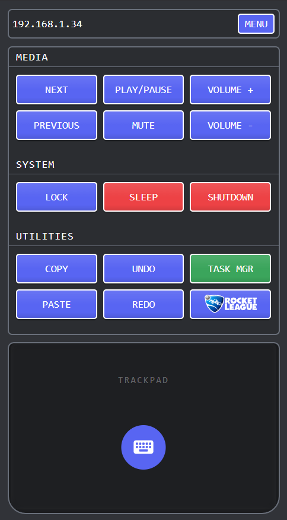

# Remote Controller ~ Turn your phone into a PC keyboard and trackpad

Remote controller is app that turns your smartphone into a wireless trackpad and keyboard for your PC. Built with raw TypeScript, Bun, Vite and Socket.IO for best real-time communication.

> 🚀 No bloat. No frameworks. Just pure performance.

---

## 📸 How it looks and feels?

Clean, intuitive, and responsive. Your phone becomes your PC:



---

## 🛠️ Installation

### Option 1: Pre-built Releases (Easiest)

1. Go to [Releases](../../releases)
2. Download:
   - **`remote-control.apk`** for Android
   - **`remote-control-setup.exe`** for Windows
3. Install and run both

### Option 2: Development Setup

#### Prerequisites
- [Bun](https://bun.sh) installed on your system

#### Setup
```bash
# Clone the repository
git clone https://github.com/LaraGuardiola/remote-controller.git
cd remote-control

# Install dependencies
bun install

# Run development server
bun dev
```

## ⚙️ Key Features

- ✅ **Smart Network Discovery**
  - Automatically scans local network (192.168.1.x, 192.168.0.x)
  - Remembers favorite IPs for instant reconnection

- 🖱️ **Full Trackpad Control**
  - Smooth touch gestures
  - Drag elements
  - Multi-finger tap detection (left/right click)
  - Precise cursor movement
  - Zoom and scroll

- ⌨️ **Virtual Keyboard**
  - Real-time text input

- 📱 **Native Mobile App (APK)**
  - Built with Capacitor

- 💪 **Native PC Bindings**
  - Written in TypeScript
  - Compiled with Bun
  - AutoIt for system-level control
  - Packaged with Inno Setup

- 🎯 **100% Stable**
  - Only dependency: Socket.IO (proven fully reliable)

---

## 🧑‍💻 Use Case Examples

- Control your PC from the couch
- Media center remote control
- Quick text input on PC from phone

## 🏗️ Tech Stack

- **Runtime**: Bun
- **Communication**: Socket.IO
- **Bundler**: Vite
- **Mobile**: Capacitor
- **System Control**: AutoIt
- **Installer**: Inno Setup Compiler
- **Language**: Pure TypeScript (no frameworks)

---

## 🔧 How It Works

1. **Server** runs on PC, listening on port 5173
2. **Mobile app** scans local network for the server
3. **WebSocket connection** established via Socket.IO
4. **Touch events** sent in real-time from phone to PC
5. **Native bindings** execute mouse/keyboard actions

## ❤️ Support

If you found this helpful, consider buying me a coffee, love some money:

[](https://www.buymeacoffee.com/webdev_slara)

---

**Made with ❤️ and way too much caffeine**
